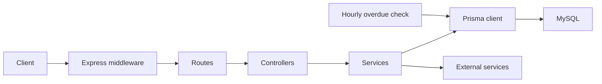

# Cyclefy Backend

A REST API for a circular-living platform where people can donate, exchange, lend, recycle, and repair items.

Cyclefy brings several item-reuse workflows into one backend. It includes user accounts, location-based discovery, request tracking, image uploads, repair payments, and in-app notifications.

## Project context and status

I built this project while learning backend development and exploring how different services work together. It gave me practical experience with Express, relational database design, authentication, file uploads, and payment integration.

This repository is part of my learning portfolio. It shows both the features I built and the engineering decisions I would improve today. Some parts are incomplete, duplicated, or inconsistent, and there are known security and reliability issues. **It is not ready for production use or real payments.**

The documentation describes the current implementation. It does not imply that the issues below have been fixed or that every workflow has passed end-to-end testing.

## Features

| Area | Current implementation |
| --- | --- |
| Accounts | Registration, email OTP verification, password login, password recovery, and profile updates |
| Social authentication | Google, Facebook, and Twitter Passport strategies; known inconsistencies remain |
| Contact information | Personal addresses with geocoding and phone-number management |
| Donation | Submit items with images and view personal status histories |
| Barter | Discover listings, offer an item, accept or decline requests, and record completion |
| Borrowing | Publish availability, request a loan, track handover and return, extend deadlines, and detect overdue loans |
| Recycling | Find recycling locations by category and distance, submit items, and view histories |
| Repair | Calculate a repair fee, submit damage photos, and request Midtrans payment instructions |
| Supporting content | Categories, news, database-backed notifications, and English/Indonesian messages |

Donation and recycling operations after submission, and repair operations after payment confirmation, do not have management endpoints in this repository. Borrowing extensions and completion notifications also have known defects. See [Known limitations](docs/known-limitations.md).

## Technology stack

- **Runtime and API:** Node.js, JavaScript ES modules, Express 5
- **Database:** MySQL and Prisma 6
- **Authentication:** bcrypt, JSON Web Tokens, Passport, Express sessions
- **Validation and uploads:** Joi and Multer
- **Integrations:** Nodemailer, OpenStreetMap geocoding, UI Avatars, Midtrans
- **Supporting tools:** i18n, Geolib, Luxon, node-cron, Winston
- **API documentation:** OpenAPI and Swagger UI
- **Testing:** Jest, Babel, and Supertest

## Architecture



This is one application with a shared database. Services contain the business rules and access Prisma directly; there is no separate repository layer. Most workflow states are stored as status-history rows rather than a status field on the main item.

See [Architecture](docs/architecture.md), [Database](docs/database.md), and [Business workflows](docs/workflows.md) for details.

## Local setup

Use a disposable development database and sandbox credentials. Read the [development guide](docs/development.md) before running seeds or tests.

Prerequisites:

- Node.js and npm compatible with the lockfile. Its Faker dependency requires Node.js `^20.19.0`, `^22.13.0`, `^23.5.0`, or `>=24.0.0`, and npm `>=10`. The repository does not pin a runtime version.
- A running MySQL database and an account allowed to apply migrations.
- SMTP credentials for email flows.
- OAuth configuration for Google, Facebook, and Twitter. All strategies are initialized at startup; leaving their credentials blank can prevent startup even when using password login.
- Midtrans sandbox credentials for payment exploration.

Run these commands from the repository root:

```bash
npm ci
cp .env.example .env
```

Edit `.env` with your local configuration. Set independent values for `JWT_SECRET` and `SESSION_SECRET`, use a development `DATABASE_URL`, and keep `MIDTRANS_IS_PRODUCTION=false`.

After checking the database target:

```bash
npx prisma generate
npx prisma migrate deploy
npm run dev
```

With `PORT=3000`, Swagger UI is available at `http://localhost:3000/api/docs`. The root URL is not a landing page or health endpoint.

The API needs reference data for categories, repair prices, and recycling locations. The optional seed command is:

```bash
npx prisma db seed
```

**Seed only a disposable database.** The seeders create demo accounts with known passwords, assume some fixed IDs, append sample records, and replace repair prices with random values. Repeated runs are not reliably idempotent. Details and troubleshooting are in the [development guide](docs/development.md).

## API usage

Most routes require a JWT returned by `POST /api/users/login`:

```http
GET /api/users/current HTTP/1.1
Host: localhost:3000
Authorization: Bearer <your-token>
Accept-Language: en
```

Messages support `en` and `id`. A typical successful response contains `success`, `message`, and `data`; paginated responses usually include `meta`.

Use the [API guide](docs/api.md) for the implemented route inventory and response conventions. The existing [OpenAPI specification](docs/openapi.yaml) includes detailed examples, but has documented differences from the code.

## Scripts and tests

| Command | Purpose |
| --- | --- |
| `npm run dev` | Start the server with Nodemon |
| `npm start` | Start the server with Node.js |
| `npm test` | Run Jest sequentially; requires an isolated test database and external-service configuration |
| `npm run railwayTest` | Install dependencies, generate Prisma, deploy migrations, and seed data; this is not a test suite |

The repository has 15 test files with 61 test cases, mainly covering basic HTTP flows. The tests are not isolated unit tests: they delete database records, write image files, and may contact SMTP, avatar, geocoding, and payment services. The Prisma import path in test utilities also differs from the application.

The documentation review included JavaScript syntax checks and static inspection. It did not establish a passing integration-test run. See [Testing](docs/development.md#testing).

## Known limitations and learning notes

I was still learning backend development when I built Cyclefy. Connecting routes, database models, authentication, and external services was already a large part of the exercise. My understanding of security boundaries, concurrent requests, failure recovery, and deployment was still developing. The implementation reflects that stage of my experience.

That is context, not a reason to describe unsafe behavior as acceptable. A working request is only one part of a reliable backend. I am keeping the limitations visible because identifying what needs to change is part of the value of revisiting this project.

**All findings below remain open in the documented version.** The portfolio and documentation work does not repair the application. The detailed register includes source references and separates code defects from questions that still need runtime verification.

### Security and account handling

- **Payment notifications are not authenticated.** The signature-check call is commented out on the public webhook. The handler also does not compare the amount with the stored payment or use the fraud decision. An incoming payload can change a known order's state without those checks.
- **A password-change response contains the new bcrypt hash.** The service returns the same object it used for the database update. Hashing a password does not make it appropriate to return that hash to clients.
- **OTP protection is incomplete.** Four-digit codes use `Math.random()`, are stored directly, have no attempt limit or resend cooldown, and earlier unused codes remain valid after a resend. The separate reset-code verification endpoint ignores expiry and usage, although the actual password-reset endpoint checks both.
- **Access-token lifecycle is incomplete.** Seven-day JWTs are not revoked by password changes or account deactivation. Protected requests do not reload account status, and there is no implemented logout/revocation or refresh flow.
- **OAuth has concrete defects.** Facebook reads an inconsistent email field; some Facebook/Twitter branches store a Google provider record; other branches skip provider upserts. OAuth login does not enforce activation, and new OAuth accounts get an unhashed placeholder password. All providers initialize even when they are not needed locally.
- **Secret and input handling need cleanup.** Experimental code contains credential-like literals whose validity was not verified. Username input is incorporated into avatar filenames without adequate path constraints. An unauthenticated geocoding test endpoint is still exposed.

See [payment findings](docs/known-limitations.md#payment-security-and-correctness) and [authentication findings](docs/known-limitations.md#authentication-and-authorization).

### Data integrity and incomplete business flows

| Area | Current problem and consequence |
| --- | --- |
| Multi-step writes | There are no application database transactions. Item, image, history, payment, and notification writes can partially succeed |
| Concurrent actions | Acceptance checks are separate from writes, with no locking or single-accepted-application invariant; competing requests can create conflicting state |
| Status histories | Some code relies on unsorted histories or timestamp-only ordering, assumes a history exists, or selects applications based on an older status |
| Completion | Barter/borrow completion notifications omit required JSON message data. Histories may be completed before the API returns an error |
| Borrowing | Requests do not enforce listing availability state; duplicate/overlap protection is commented out. Discovery hides already-started availability windows |
| Borrow dates and extensions | End-of-day handling and duration calculations differ. An extended loan cannot immediately follow the normal return or further-extension path |
| Barter reuse | Existing items are copied without a source relationship, reservation, or synchronized completion. Duplicate protection is limited |
| Contact and category rules | Historical activities use mutable contact records; phone-update duplicates are not checked. Inactive categories can be submitted, and recycling submissions do not verify location/category compatibility |
| Payment reliability | Duplicate callbacks append histories, out-of-order events can overwrite terminal states, and timestamps can be cleared. There is no reconciliation. Retrying pending payments sends another charge request; terminal failures do not create replacement orders |
| Repair calculation | Fractional weights have no defined rounding policy for integer amounts. Payment selection, provider validation, billing fields, and timestamp handling are inconsistent |
| Missing operational features | Donation/recycling progression, recipient/pickup management, technician/warehouse management, and later repair transitions have no operational endpoints |
| Notifications and content | Acceptance, decline, and overdue notifications are absent. News has read endpoints but no publishing workflow. The seeded Admin user has no special permissions |

These are described in the [data-integrity findings](docs/known-limitations.md#data-integrity-and-workflow-state) and [business-rule gaps](docs/known-limitations.md#business-rule-gaps).

### API correctness and maintainability

Several endpoints have broken filters, missing imports, and incorrect URL-helper calls. Profile/news images can return null URLs; external profile URLs can be malformed. Repair-type filtering targets the wrong field, and borrow history queries a category relation that does not exist. Address-label updates still trigger geocoding. Some nullable fields are handled as required strings.

Error behavior is also inconsistent: invalid JWTs can return 500, unexpected internal messages can reach clients, and some failure branches themselves throw errors. Response envelopes, image shapes, status formats, field names, HTTP statuses, and translations differ across modules. The OpenAPI specification contains incorrect paths/query names, missing responses, and payment retry promises that the code does not fulfill.

The services contain repeated patterns, long positional argument lists, unused imports, commented experiments, and presentation logic tied to Express requests. These make changes harder to apply consistently. The [API defect register](docs/known-limitations.md#api-defects-and-inconsistent-responses) and [API contract differences](docs/api.md#openapi-differences) identify the specific cases.

### Storage, performance, tests, and operations

- Uploads trust supplied MIME types and original extensions. File-size limits and most file-count limits are absent, timestamp-based names can collide, and cleanup can leave orphaned files or database rows. Assets live on public local disk rather than durable shared storage.
- Many lists load records and relations before paginating in memory. Composite indexes for common history/notification queries have not been designed around the workload.
- Sessions use memory storage and default cookie options. CORS is hard-coded, environment values lack startup validation, and public URLs depend on incomplete proxy/host handling.
- Every server instance registers the same cron job without coordination. Graceful shutdown, readiness checks, request tracing, and production monitoring are not implemented.
- Tests perform broad database deletion without a target guard, omit newer tables during cleanup, create files, and call external services. Some assertions are weak or stale, and critical security, concurrency, and transition paths lack coverage. A passing integration-test baseline has not been established in this review.
- Seeds create known demo credentials, append data, assume fixed IDs, and overwrite prices randomly. They can generate records that bypass the API's ownership rules.
- Prisma client imports/versions differ between application and test tooling. Runtime versions are not pinned; CI and container/deployment manifests are absent. `railwayTest` installs, migrates, and seeds instead of running tests.
- Package metadata and some source names are leftovers from earlier work. The declared ISC license has no standalone license file in this snapshot.

See [storage and operations](docs/known-limitations.md#uploads-performance-and-operations) and [tests and tooling](docs/known-limitations.md#tests-seeds-tooling-and-metadata) for evidence and details.

### What I would improve first

My next priorities would be account/payment security and secret cleanup, then transactional state changes and borrowing correctness, followed by isolated tests and a consistent API contract. Storage, performance, operations, and missing product workflows would follow that foundation. These are future priorities, not completed fixes.

The [full limitations register](docs/known-limitations.md) is the detailed companion to this README. It documents all findings identified in the review, their effects, affected source areas, and remaining uncertainties. It is not a claim that every possible defect has been discovered. Use this version for local learning and code review until the security and reliability issues are addressed.

## Documentation

| Document | Contents |
| --- | --- |
| [Documentation index](docs/README.md) | Suggested reading order and review scope |
| [Architecture](docs/architecture.md) | Structure, entry points, layers, middleware, and integrations |
| [Database](docs/database.md) | Models, relationships, constraints, and migrations |
| [Business workflows](docs/workflows.md) | Authentication, submissions, barter, borrowing, repair, and notifications |
| [API guide](docs/api.md) | Routes, request formats, response conventions, and contract differences |
| [Development guide](docs/development.md) | Setup, environment variables, seeds, tests, and deployment considerations |
| [Known limitations](docs/known-limitations.md) | Current defects, technical debt, and future work |
| [Work behind the work](docs/work-behind-the-work.md) | A personal portfolio story about the approach, tradeoffs, limitations, and lessons |

## Author and license

Created by **Muhammad Zhafran Ilham** as a backend learning project.

The package metadata declares **ISC**. A standalone license file is not included in this snapshot. The package name and description also still refer to an earlier contact-management API; these are recorded as metadata cleanup items.
