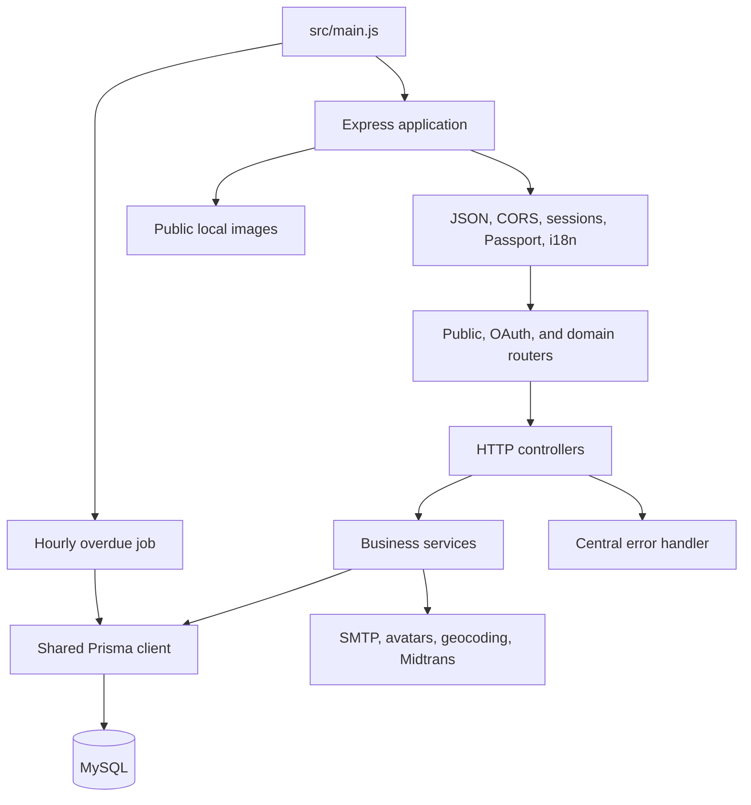

# Architecture

[Documentation index](README.md) · [Project README](../README.md)

## System shape

Cyclefy is a single Express application using JavaScript ES modules and a shared MySQL database through Prisma. Its folders separate HTTP routing, controllers, services, validation, middleware, and helpers.



There is no repository abstraction, dependency-injection container, message queue, cache, or separate worker service. Status histories provide workflow tracking; this is not a full event-sourcing architecture.

## Project structure

```text
src/
  main.js                 HTTP listener and cron registration
  application/            Express, environment, database, logger, integrations
  routes/                 Public, OAuth, and domain route definitions
  controllers/            Request extraction and HTTP responses
  services/               Business rules, data access, and response mapping
  middlewares/            JWT authentication, upload handlers, errors
  validations/            Joi schemas and validation error formatting
  helpers/                Ownership, JWT, dates, distance, URLs, OTPs, overdue job
  errors/                 ResponseError class
  assets/                 Checked-in bank images and runtime uploads
  generated/prisma/       Generated client; ignored and absent until generation
prisma/
  schema.prisma           Generator, MySQL datasource, Category model
  schema/                 Domain schema files
  migrations/             Three checked-in SQL migrations
  seed.js                 Seed runner
  seeders/                Sample and reference data
test/                     Jest/Supertest integration-style tests
locales/                  English and Indonesian messages
docs/                     Markdown guides and OpenAPI specification
```

## Entry points and startup

[main.js](../src/main.js) imports environment configuration, logging, and the Express application, then listens on `env.port`. It registers `0 0 * * * *`, a six-field cron expression for the top of every hour, to run the overdue borrowing check.

[web.js](../src/application/web.js) exports the app without calling `listen`. Tests import this object, so they do not register the cron job from `main.js`.

[seed.js](../prisma/seed.js) is a separate process. It creates reference and demo data in sequence, then disconnects its Prisma client.

Prisma is generated into `src/generated/prisma/`. Application database access imports that generated client. The test utilities instead import `@prisma/client`; this difference needs to be resolved before relying on the suite.

## Request pipeline

The middleware order in `web.js` is:

1. Parse JSON bodies with `express.json()`.
2. Apply credential-enabled CORS for the two hard-coded frontend origins.
3. Install Express sessions, Passport initialization, and Passport sessions.
4. Serve Swagger UI at `/api/docs` using the checked-in YAML file.
5. Initialize i18n with `en` and `id`, English by default, and a `lang` query option.
6. Mount public routes, OAuth routes, and the domain router under `/api`.
7. Serve configured image directories under `/assets/...`.
8. Return a JSON 404 for unmatched requests.
9. Handle errors through `errorMiddleware`.

JWT authentication is attached per endpoint. Of the 72 route registrations, 57 use `authMiddleware`. The public authentication/OAuth routes, payment webhook, and geocoding test route do not require a bearer token. Swagger and static mounts are outside this route count.

## Layer responsibilities

| Layer | Responsibilities and current boundaries |
| --- | --- |
| Routes | Choose controller and middleware; multipart upload runs after JWT verification |
| Controllers | Extract `req.user.id`, parse parameters, invoke services, send JSON, forward errors; some clean up files |
| Services | Run Joi validation, verify ownership, query/write Prisma, call integrations, create notifications, shape response data |
| Helpers | Shared ownership checks, URL generation, distance calculations, dates, OTPs, and JWT operations |
| Data access | Shared Prisma singleton imported directly; no repositories or raw SQL in application code |

Exceptions to the usual controller/service boundary are the payment notification controller, Passport callbacks, and overdue helper, which query Prisma directly.

Services frequently accept the Express request object for translation and absolute URL generation. This makes them harder to test without HTTP context. Many use long positional argument lists, especially listing and history filters.

## Validation and error handling

[validation.js](../src/validations/validation.js) runs Joi with `abortEarly: false` and `allowUnknown: false`. It returns converted values, so numeric multipart fields can become numbers. Validation failures become a `ResponseError` with HTTP 400 and an object of field errors.

Controllers usually convert path IDs with `Number` and check that they are finite integers. This helper does not require positive values. Query validation is mostly manual and differs by controller; no global page-size limit exists.

[ResponseError](../src/errors/responseError.js) stores `status`, `message`, and `errors`. The [error middleware](../src/middlewares/errorMiddleware.js) translates the message and uses an integer status or defaults to 500. Unexpected error messages can reach clients. Invalid-token handling, missing imports, and early middleware errors have known failure paths; see the limitations register.

## Workflow state and consistency

Donation, barter, borrowing, recycling, and repair use separate status-history tables. Applications for barter and borrowing also have their own histories. Services usually load the newest row or order histories ascending for a timeline.

There is no shared transition engine. Status checks and paired writes are repeated across services. No application `$transaction` calls were found. Creating an item, images, history, payment, and notification is a sequence of independent operations, so failures can leave partial state.

The hourly job runs in each server process. It has no distributed lock or persistent job queue, and no overdue notifications are currently sent.

## Integrations

| Integration | Code | Use |
| --- | --- | --- |
| SMTP / Nodemailer | [mailer.js](../src/application/mailer.js) | Verification and password-reset email |
| UI Avatars | [authHelper.js](../src/helpers/authHelper.js) | Download default profile images during manual registration |
| Google, Facebook, Twitter | [passport.js](../src/application/passport.js) | Social account creation/login and provider records |
| OpenStreetMap / NodeGeocoder | [nodeGeocoder.js](../src/application/nodeGeocoder.js) | Convert address text into location data |
| Geolib | [geoHelper.js](../src/helpers/geoHelper.js) | Local straight-line distance calculations; no routing API call |
| Midtrans Core API / Axios | [repairService.js](../src/services/repairService.js) | Create payment instructions |
| Midtrans SDK | [midtrans.js](../src/application/midtrans.js) | Initializes a Snap client; active payment initiation uses Axios instead |

An unused seed-image helper calls Pexels despite its Unsplash-oriented name. Active sample image generation mainly uses dummy-image URLs.

## Storage and responses

Multer writes images below `src/assets/`. Public paths are stored in image tables and usually expanded into absolute URLs using request protocol/host. Profiles, donations, barter listings/applications, borrow listings, recycling posts/locations, and repairs have static mounts.

Borrow application upload middleware exists but is not used by the active routes. Bank images exist on disk but their seeded URLs are not covered by the configured mounts.

Most controllers return `{ success, message, data }`. List controllers usually add `meta`. There is no shared response serializer, and notifications, status values, image representations, and HTTP status codes have exceptions described in the [API guide](api.md).
