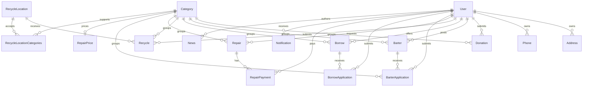

# Database Model

[Documentation index](README.md) · [Architecture](architecture.md)

## Configuration and naming

The datasource is MySQL, configured by `DATABASE_URL`. Prisma reads the schema directory through the `prisma.schema` setting in [package.json](../package.json).

The schema contains 36 models and 13 enums. Models use PascalCase in Prisma and map to mostly snake_case table names. Fields generally use snake_case. IDs are auto-incrementing integers except `BorrowImage.id`, which is a UUID string. Most entities have `created_at` and `updated_at` timestamps.

## Model inventory

| Schema | Models |
| --- | --- |
| [schema.prisma](../prisma/schema.prisma) | `Category` |
| [user.prisma](../prisma/schema/user.prisma) | `User`, `Phone`, `Address`, `EmailVerification`, `UserOauthProvider`, `PasswordReset` |
| [donation.prisma](../prisma/schema/donation.prisma) | `Donation`, `DonationImage`, `DonationStatusHistory` |
| [barter.prisma](../prisma/schema/barter.prisma) | `Barter`, `BarterImage`, `BarterStatusHistory`, `BarterApplication`, `BarterApplicationImage`, `BarterApplicationStatusHistory` |
| [borrow.prisma](../prisma/schema/borrow.prisma) | `Borrow`, `BorrowImage`, `BorrowStatusHistory`, `BorrowApplication`, `BorrowApplicationStatusHistory` |
| [recycle.prisma](../prisma/schema/recycle.prisma) | `Recycle`, `RecycleImage`, `RecycleStatusHistory`, `RecycleLocation`, `RecycleLocationImage`, `RecycleLocationCategories` |
| [repair.prisma](../prisma/schema/repair.prisma) | `Repair`, `RepairImage`, `RepairStatusHistory`, `RepairPrice` |
| [transaction.prisma](../prisma/schema/transaction.prisma) | `RepairPayment`, `Bank` |
| [notification.prisma](../prisma/schema/notification.prisma) | `Notification` |
| [news.prisma](../prisma/schema/news.prisma) | `News`, `NewsImage` |

## Main relationships

This diagram shows the main relationships. Image and history tables are omitted to keep it readable.

All five main item entities reference an address and phone in addition to their owner and category. Both application models also reference an applicant address and phone. Borrow applications inherit their item category through the parent listing; they have no direct category field.

## Accounts and contact data

`User` has unique username/email fields, a password string, verification/activation flags, and an optional profile picture. There is no role, permission, refresh-token, or session table.

`Address` stores a label, formatted address, coordinates, and optional city/state/zipcode fields. Its geocoded country and country code are required. `Phone` stores a number string; the database does not enforce uniqueness per user.

Verification and reset records store a code, expiry, and used flag. Email verification also stores a verification timestamp. `UserOauthProvider` has a unique `(user_id, provider)` pair and JSON provider data, but no unique `(provider, provider_id)` constraint.

Contact records are live references. Updating an address or phone changes the values shown by old requests. The database verifies that a referenced record exists, but service checks are responsible for ensuring it belongs to the correct user.

## Items, applications, and histories

Each main item has an image collection and a status-history collection. Histories contain an enum status, description/key, timestamps, and an optional `updated_by` user.

Current status is derived from histories. The schema does not require an item to have a history row, identify the current row, or enforce legal transitions. Some code assumes histories are nonempty.

Barter applications store a separate offered item. Copying an existing listing into an application does not store that source listing ID. Borrow applications store a reason and requested date range instead of another item.

`Borrow` stores the owner's availability window; `BorrowApplication` stores the applicant's requested window. There is no reservation constraint, stock count, or unique active-application constraint.

## Recycling and repair

`RecycleLocationCategories` is an explicit join table. It has no unique constraint on the location/category pair. Locations also contain contact data and images.

`Repair` stores item weight as a floating-point number, a repair type (`minor_repair`, `moderate_repair`, `major_repair`), and location choice (`my_location`, `warehouse`). There is no warehouse or technician model.

`RepairPrice` has one row per category, enforced by unique `category_id`, and integer prices for the three repair types. `RepairImage.image_type` is optional and uses the enum named `RepaiImageType` in the schema; the spelling is part of the current source.

## Payments, notifications, and news

`RepairPayment` supports multiple payments per repair and stores integer amount/admin fee, a unique nullable order ID, payment method, gateway instructions, status, and payment/expiry timestamps. There is no currency column, webhook-event table, or gateway-event uniqueness constraint. `Bank` is a separate lookup table; payment bank codes are plain strings.

`Notification` belongs to a user and stores `type`, `entity_id`, title, translation key, required JSON `message_data`, read status, and redirect URL. The generic entity ID is not a foreign key to the associated domain table.

`News` belongs to a user and stores a title and long-text content with related images. No publication status or editorial permissions exist.

## Constraints and deletion behavior

The migrations use `ON DELETE RESTRICT` for required relationships and `ON DELETE SET NULL` for optional history actors. Parent deletions do not automatically remove their children.

Address/phone deletion catches Prisma foreign-key errors and returns a domain error. This applies to any reference, including completed activities, even though the translated message mentions ongoing activities.

There are no explicit schema indexes for common composite lookups such as `(entity_id, created_at)` histories or `(user_id, created_at)` notification lists. This does not mean that MySQL has no primary, unique, or foreign-key indexes.

No application transaction boundaries protect paired histories, acceptance of one application, image insertion, or notification creation. See [Known limitations](known-limitations.md) for the resulting consistency risks.

## Migrations and seed data

| Migration | Purpose |
| --- | --- |
| `20250904114028_create_init_table` | Initial domain, account, category, and payment tables |
| `20250916203315_notification_table` | Notifications |
| `20250917010456_create_news_table` | News and news images |

A static comparison found matching model/table scalar-column names and enum values. It did not verify a deployed database, generated client, indexes at runtime, or migration execution.

The seed runner populates banks, categories, users, phones, addresses, donations, recycling locations, repair prices, recycling submissions, repairs/payments, and news. It does not seed barter or borrowing listings. Several seeders assume fixed IDs or select contacts independently of item owners, so sample data can violate ownership rules enforced by the API. See the [development guide](development.md#seed-data).
